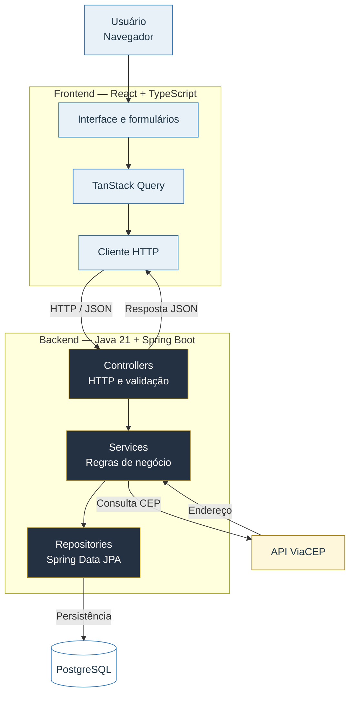

# Stellantis Motors — Gestão de Veículos e Concessionárias

Aplicação full stack desenvolvida para o desafio técnico de gerenciamento de veículos e concessionárias.

O sistema permite cadastrar, consultar, editar e excluir veículos e concessionárias, associar veículos a uma unidade e preencher automaticamente o endereço da concessionária por meio da API ViaCEP.

## Funcionalidades

### Veículos

- Listagem e pesquisa por marca, modelo, cor, ano ou chassi.
- Filtro por concessionária e por veículos sem associação.
- Cadastro, edição e exclusão.
- Associação opcional com uma concessionária.
- Registro de marca, modelo, combustível, cor, ano, chassi, valor e imagem.
- Tratamento de carregamento, lista vazia, erro e falha de imagem.

### Concessionárias

- Listagem e pesquisa por razão social, CNPJ, cidade ou estado.
- Cadastro, edição e exclusão.
- Consulta automática de endereço pelo CEP durante o cadastro.
- Exibição da quantidade de veículos associados a cada unidade.
- Proteção visual contra exclusão de concessionária que ainda possui veículos.

## Arquitetura da solução

![Desenho da arquitetura da solução]

## Arquitetura da solução



O repositório segue uma organização de monorepo simples. Backend e frontend ficam no mesmo controle de versão, mas possuem dependências e processos de execução independentes.

O fluxo principal é:

1. O usuário interage com a SPA desenvolvida em React.
2. O frontend utiliza TanStack Query e o cliente HTTP compartilhado para acessar a API.
3. Os Controllers do Spring Boot recebem e validam os DTOs.
4. Os Services aplicam regras de negócio e coordenam as operações.
5. Os Repositories utilizam Spring Data JPA para acessar o PostgreSQL.
6. No cadastro de concessionárias, o backend consulta o ViaCEP antes de persistir o endereço.

## Tecnologias utilizadas

### Backend

- Java 21
- Spring Boot 4.1
- Spring MVC
- Spring Data JPA
- Jakarta Validation
- PostgreSQL
- Springdoc OpenAPI / Swagger UI
- JUnit, Mockito e MockMvc
- Maven Wrapper

### Frontend

- React 19
- TypeScript
- Vite
- React Router
- TanStack Query
- React Hook Form
- Zod
- Lucide React
- CSS puro organizado por componentes
- Oxlint

## Estrutura do repositório

```text
desafio-accenture/
├── backend/                 # API REST Spring Boot
│   ├── src/main/java/       # Código da aplicação
│   ├── src/main/resources/  # Configurações
│   ├── src/test/            # Testes automatizados
│   ├── mvnw
│   └── pom.xml
├── frontend/                # SPA React + TypeScript
│   ├── src/features/        # Funcionalidades de veículos e concessionárias
│   ├── src/shared/          # API, componentes e estilos compartilhados
│   └── package.json
├── docs/
│   └── arquitetura.svg      # Desenho da arquitetura
└── README.md
```

## Pré-requisitos

Antes de iniciar, instale:

- Java 21
- Node.js 24 ou versão compatível com o projeto
- npm 11 ou versão compatível
- PostgreSQL
- Git

Você pode verificar as instalações com:

```bash
java --version
node --version
npm --version
git --version
```

## Como executar o projeto

### 1. Clonar o repositório

```bash
git clone https://github.com/DyelsonMota-fs/desafio-accenture.git
cd desafio-accenture
```

### 2. Preparar o banco de dados

Com o PostgreSQL em execução, crie o banco:

```sql
CREATE DATABASE desafio_veiculos;
```

O backend utiliza as seguintes configurações:

```properties
spring.datasource.url=jdbc:postgresql://localhost:5432/desafio_veiculos
spring.datasource.username=${DB_USERNAME:postgres}
spring.datasource.password=${DB_PASSWORD}
```

O Hibernate está configurado com `ddl-auto=update`, portanto as tabelas são criadas ou atualizadas automaticamente durante o desenvolvimento.

### 3. Iniciar o backend

Abra um terminal na raiz do repositório.

#### Git Bash ou Linux/macOS

```bash
cd backend
export DB_USERNAME=postgres
export DB_PASSWORD=sua_senha
./mvnw spring-boot:run
```

#### Windows PowerShell

```powershell
cd backend
$env:DB_USERNAME="postgres"
$env:DB_PASSWORD="sua_senha"
./mvnw.cmd spring-boot:run
```

O backend estará disponível em:

```text
http://localhost:8080
```

Documentação Swagger:

```text
http://localhost:8080/swagger-ui/index.html
```

### 4. Iniciar o frontend

Abra outro terminal na raiz do repositório:

```bash
cd frontend
npm install
npm run dev
```

A interface estará disponível em:

```text
http://localhost:5173
```

Por padrão, o frontend acessa a API em `http://localhost:8080`. Para utilizar outro endereço, crie um arquivo `frontend/.env`:

```env
VITE_API_URL=http://localhost:8080
```

## Endpoints principais

### Veículos

| Método   | Endpoint         | Descrição               |
| -------- | ---------------- | ----------------------- |
| `GET`    | `/vehicles`      | Lista todos os veículos |
| `GET`    | `/vehicles/{id}` | Busca um veículo por ID |
| `POST`   | `/vehicles`      | Cadastra um veículo     |
| `PUT`    | `/vehicles/{id}` | Atualiza um veículo     |
| `DELETE` | `/vehicles/{id}` | Exclui um veículo       |

### Concessionárias

| Método   | Endpoint                | Descrição                                       |
| -------- | ----------------------- | ----------------------------------------------- |
| `GET`    | `/dealer`               | Lista todas as concessionárias                  |
| `GET`    | `/dealer/{id}`          | Busca uma concessionária por ID                 |
| `POST`   | `/dealer`               | Cadastra uma concessionária e consulta o ViaCEP |
| `PUT`    | `/dealer/{id}`          | Atualiza uma concessionária                     |
| `DELETE` | `/dealer/{id}`          | Exclui uma concessionária                       |
| `GET`    | `/dealer/{id}/vehicles` | Lista os veículos de uma concessionária         |

## Validação e tratamento de erros

O projeto aplica validação em duas camadas:

- O frontend utiliza Zod e React Hook Form para fornecer feedback imediato.
- O backend utiliza Jakarta Validation e validadores personalizados para proteger o contrato da API.

O backend também possui um tratamento global de exceções. Erros de validação retornam um mapa no formato `campo: mensagem`, permitindo que o frontend associe a mensagem ao campo correspondente.

## Integração com ViaCEP

Durante o cadastro de uma concessionária, o frontend envia razão social, CNPJ, CEP e número. O backend consulta o ViaCEP, complementa o endereço e somente depois persiste os dados no PostgreSQL.

Essa decisão centraliza a integração externa no backend e evita que diferentes clientes precisem implementar a mesma regra.

## Testes e qualidade

### Backend

Na pasta `backend`:

```bash
./mvnw test
```

No Windows PowerShell, também é possível utilizar:

```powershell
./mvnw.cmd test
```

### Frontend

Na pasta `frontend`:

```bash
npm run lint
npm run build
```

O comando de build executa a verificação do TypeScript antes de gerar os arquivos de produção.

## Decisões técnicas

- **Spring Boot:** reduz configuração repetitiva e oferece integração direta entre API, validação e persistência.
- **PostgreSQL:** representa adequadamente o relacionamento entre concessionárias e veículos e aproxima o desafio de um ambiente real.
- **DTOs:** mantêm o contrato HTTP separado das entidades persistidas.
- **React com TypeScript:** oferece componentização e segurança na comunicação com a API.
- **TanStack Query:** administra cache, carregamento, erros, mutations e atualização das listas.
- **React Hook Form e Zod:** centralizam tipagem e validação dos formulários.
- **CSS puro:** preserva uma identidade visual própria e demonstra domínio dos fundamentos da interface.
- **Oxlint:** oferece análise estática rápida e configuração enxuta.

## Autor

Desenvolvido por [Dyelson Mota](https://github.com/DyelsonMota-fs).
